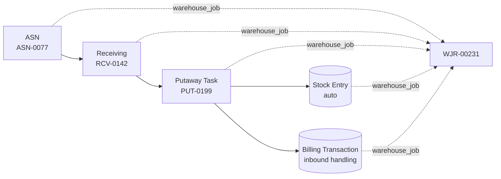
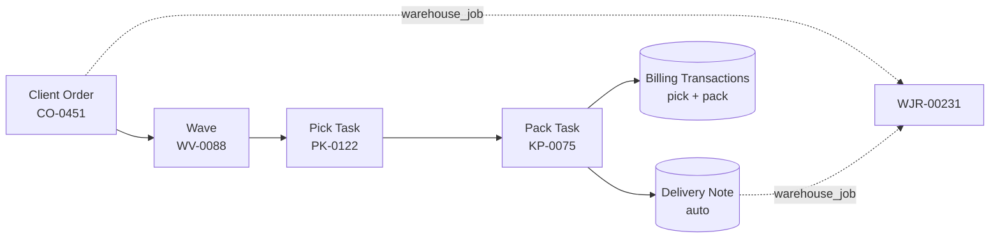

This page follows a single job through every step of Warehouse 3PL. It's
the best way to ground the [architecture](/guide/architecture/) in concrete
data movements.

## Scenario

- **Client** — Acme Goods (`client_code = ACME`).
- **Inbound** — 100 cartons of `ACME-WIDGET-01` arriving on a pallet.
- **Outbound** — later, an order for 24 cartons to a retail DC.

## Inbound half

### 1 — ASN (`ASN-0077`)

Client submits an ASN. The header captures `expected_arrival`, the lines
capture SKU + expected qty + expected batch. On submit, a new
**Warehouse Job Record** (`WJR-00231`) is created and stamped on the ASN.

### 2 — Receiving (`RCV-0142`)

Dock operator runs **Create Receiving** on the ASN. The ASN maps into
`RCV-0142` via `get_mapped_doc`. Operator counts: 98 good cartons, 2
damaged. QC passes the 98; the 2 are marked `rejected`.

### 3 — Putaway Task (`PUT-0199`)

Submitting Receiving generates one Putaway Task per accepted line. The
Putaway Engine suggests bin `A-04-02` (ambient zone, 60% free, near the
forward pick face). Operator accepts.

### 4 — Stock Entry (auto)

`complete_putaway()` creates a zero-value Stock Entry moving 98 cartons
from the receiving staging bin to `A-04-02`. The SE carries `client`,
`warehouse_job`, and `asn` on its custom fields.

### 5 — Billing Transaction (auto)

Inbound handling fires via `billing.create_billing_transaction`. It looks
up ACME's `active_rate_card` and finds a line like
`inbound_per_pallet @ $12.50` — one BT row is written with
`source_doctype = Putaway Task`.

## Outbound half

A week later, an order for 24 cartons:

### 6 — Client Order (`CO-0451`)

24 × `ACME-WIDGET-01`. Client Item → internal Item translation happens on
submit. Header has `required_by` and a target `carrier`.

### 7 — Wave (`WV-0088`)

Supervisor adds `CO-0451` (plus a few other ACME orders) to
`WV-0088`. **Release Wave** calls the Allocation Engine:

- FIFO allocation, because ACME's Inventory Policy says so.
- Bin `A-04-02` has the oldest batch — the full 24 comes from there.

One Pick Task `PK-0122` is generated.

### 8 — Pick Task (`PK-0122`)

Picker scans the task, walks to `A-04-02`, takes 24 cartons, scans
confirmation. `complete_pick()` fires → creates Pack Task `KP-0075`.

### 9 — Pack Task (`KP-0075`)

Packer combines into 2 master cartons, weighs them, assigns tracking
numbers under DHL. `complete_pack()` runs.

### 10 — Delivery Note (auto)

A Delivery Note is created against Acme as the customer, with `client`,
`warehouse_job`, `carrier`, `tracking_number`, `wave` and `bol_number` all
populated. Stock leaves, 24 cartons off `A-04-02`.

### 11 — Billing Transactions (auto)

`billing.create_billing_transaction` writes two rows for this Pack Task:

| activity_type | qty | rate | amount |
|---|---|---|---|
| `pick_per_line` | 1 | 0.60 | 0.60 |
| `pack_per_carton` | 2 | 1.25 | 2.50 |

## What the Warehouse Job Record shows

Opening `WJR-00231`:

- **Job Operational Info** — 1 Receiving, 1 Putaway, 1 Pick, 1 Pack.
- **Job Stock Movement** — SE (in, +98) and the outbound SL Entry (-24).
- **Job Voucher** — the auto-created Delivery Note, plus any draft
  Purchase Invoice from a carrier bill if one has been booked.
- **Live P&L dashboard** — $12.50 + $0.60 + $2.50 = $15.60 revenue
  against whatever costs are booked.

## Where to go next

- [Architecture](/guide/architecture/) for the big-picture map.
- [Utility Engines](/guide/engines/) for the allocation / policy / putaway
  APIs.
- [Billing Reference](/reference/billing/) for all activity types.
