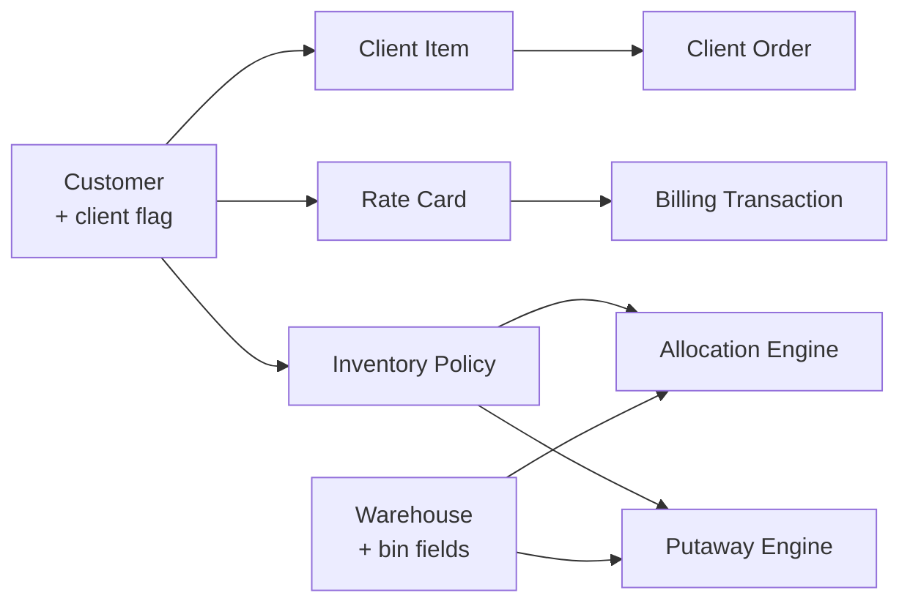

Master data is the slow-changing configuration that operational docs read
at runtime. Getting this right at setup saves a lot of pain later.

## Client (Customer)

A 3PL client is a standard ERPNext **Customer** with these custom fields:

| Field | Purpose |
|---|---|
| `is_3pl_client` | Flag — turns on the 3PL-specific UI and filters. |
| `client_code` | Short code used on labels, reports, and Client Item SKUs. |
| `default_temp_zone` | Default storage zone for this client's goods. |
| `active_rate_card` | Link to the Rate Card the billing engine should use. |

## Warehouse (as a bin)

Each physical bin is a Frappe **Warehouse**. Warehouse 3PL adds:

| Field | Purpose |
|---|---|
| `temperature_zone` | Ambient / Chilled / Frozen. |
| `zone_type` | Receiving / Storage / Picking / Staging. |
| `aisle`, `rack`, `level` | Physical address. |
| `bin_code` | Short label printed on bin signs and scanners. |
| Capacity fields | Max volume / weight — used by the Putaway Engine. |

## Item

Standard Item with 3PL-specific additions:

| Field | Purpose |
|---|---|
| `storage_temp_zone` | Which temperature zone this item belongs in. |
| `hazmat_class` | Classification for hazmat handling rules. |
| `lot_tracking` | Whether batches must be tracked. |
| `velocity_class` | A/B/C classification used by the Putaway Engine for forward-pick placement. |

## Batch

Batches are tracked when `item.lot_tracking = 1`:

| Field | Purpose |
|---|---|
| `supplier_lot` | Vendor-provided lot reference. |
| `receiving_date` | Used by the FIFO branch of the Allocation Engine. |
| `country_of_origin` | Compliance / customs reporting. |
| `qc_status` | Pending / Passed / Held / Rejected. |

## Client Item

Maps the client's SKU to the internal Item master:

| Field | Purpose |
|---|---|
| `client` | The Customer this mapping belongs to. |
| `client_item_code` | What the client uses in their system. |
| `item_code` | The internal ERPNext Item. |
| `client_description` | Free-text label used on client-facing outputs. |
| `pack_factor` | UoM conversion if the client orders in cases but stores in eaches. |

## Rate Card

Per-client price book. See [Billing Reference](/reference/billing/) for
the full set of activity types.

## Inventory Policy

See [Policy Engine](/reference/policy-engine/).

## Warehouse Location

A row-level detail of a bin used by the Putaway Engine when a single
Warehouse represents a larger bank of identical slots. Most sites don't
need this.

## Where each record is used

