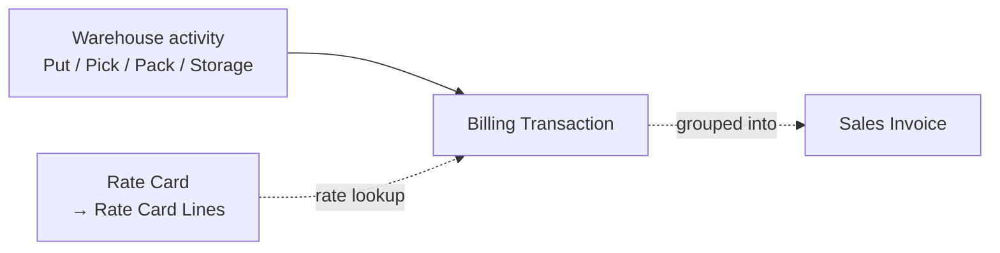

Billing is automatic. Every operational event that costs money — inbound
handling, storage days, pick lines, pack cartons, carrier handoff — raises
a **Billing Transaction** using a rate resolved from the client's active
**Rate Card**.

## The pieces

- **Rate Card** — a per-client catalogue. Example lines: `Inbound per
  pallet`, `Storage per pallet per day`, `Pick per line`, `Pack per
  carton`, `Surcharge — hazmat`.
- **Billing Transaction** — one row per activity × unit. Created by
  `warehouse_3pl.utils.billing.create_billing_transaction()`.
- **Sales Invoice** — standard ERPNext invoice, generated by grouping
  unbilled Billing Transactions per client per period.

## Configuring a Rate Card

1. In Desk, open **Rate Card > New**.
2. Set the **Client**.
3. Add Rate Card Lines — each with:
   - `activity_type` (must match one of the constants used by the billing
     engine — see [Billing Reference](/reference/billing/));
   - `uom` — the unit the rate is priced by;
   - `rate` — the per-unit price;
   - optional `min_charge` and `effective_from` / `effective_to`.
4. Back on the **Customer** record, set this Rate Card as the
   `active_rate_card`.

## What a Billing Transaction looks like

| Field | Example |
|---|---|
| `client` | Acme Goods |
| `warehouse_job` | WJR-00231 |
| `activity_type` | pack_per_carton |
| `quantity` | 6 |
| `rate` | 1.25 |
| `amount` | 7.50 |
| `source_doctype` / `source_name` | Pack Task / PK-0042 |
| `is_invoiced` | 0 (until rolled into a Sales Invoice) |

## Rolling up to an invoice

At month-end (or any cadence the finance team runs), unbilled Billing
Transactions are grouped by `client` and pulled into a standard ERPNext
**Sales Invoice**. Each Sales Invoice line references one Billing
Transaction group, and the `warehouse_job` custom field on the SI lets
ops reconcile back to the source.

## Live P&L on the job

Because the Warehouse Job Record links drafts as well as submitted
SI/PI/JE, supervisors see live P&L per job — no waiting for month-end
close. See [Warehouse Job Record](/user/warehouse-job/).
