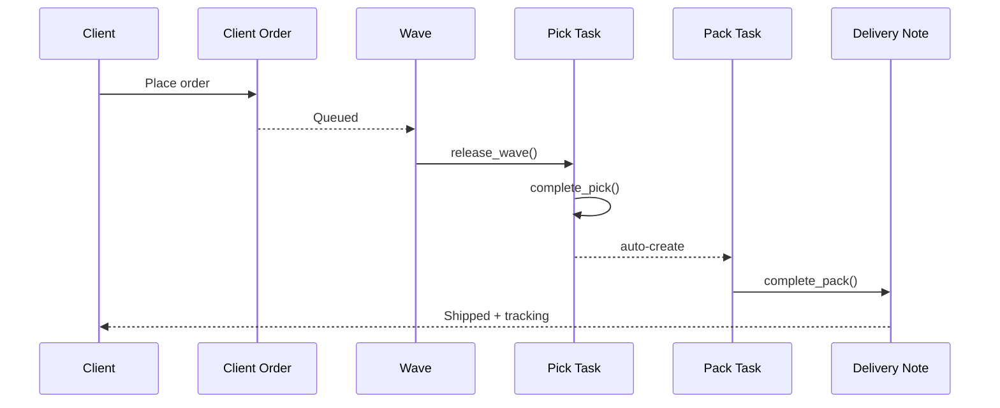

The outbound flow turns a client order into a packed, shipped parcel and a
Delivery Note. Five doctypes cooperate, with FIFO/FEFO allocation done by
the [Allocation Engine](/guide/engines/).

## Step 1 — Client Order

A **Client Order** is the client's fulfillment request. It has:

- a header with `client`, `ship_to_address`, `required_by`, `carrier_hint`;
- **Client Order Lines** — one per client SKU + quantity.

Client Items are translated to internal Items at submit time so the rest of
the pipeline speaks ERPNext's item master.

## Step 2 — Wave

A **Wave** groups Client Orders for a picking round. The supervisor builds
the wave by filters: client, zone, carrier cutoff time, order priority.

Pressing **Release Wave** (`Wave.release_wave()`) runs the Allocation
Engine, generates **Pick Tasks**, and marks the selected orders as
`Allocated`.

Waves are usually sized around:

- **Carrier cutoffs** — "All orders shipping via DHL before 3pm".
- **Picker shifts** — the number of active pickers × a target task size.
- **Zone affinity** — one wave per temperature zone or aisle cluster.

## Step 3 — Pick Task

A **Pick Task** is one picker's walk through the warehouse. Its lines list
the exact bin, batch, and quantity to take — resolved by FIFO or FEFO per
the [Inventory Policy](/reference/policy-engine/).

Lifecycle:

1. `start_pick()` — picker scans the task and begins.
2. Picker confirms each line bin-by-bin.
3. `complete_pick()` — on completion the app **auto-creates the Pack Task**.

## Step 4 — Pack Task

A **Pack Task** groups one or more picks into outbound parcels. The packer
records:

- carton count and dimensions;
- weight;
- carrier and tracking number;
- BOL number (for freight).

`complete_pack()` auto-creates a **Delivery Note** in ERPNext with the
carrier, tracking number and wave reference already populated on the
custom fields.

## Step 5 — Delivery Note

A standard ERPNext **Delivery Note** closes the loop: stock leaves, the
client's inventory snapshot drops, and the outbound Billing Transaction is
raised (pick + pack + carrier handoff lines).

## End-to-end diagram

## Next

- [Warehouse Job Record](/user/warehouse-job/) — how all of this rolls up.
- [Billing & Rate Cards](/user/billing/) — how it turns into an invoice.
