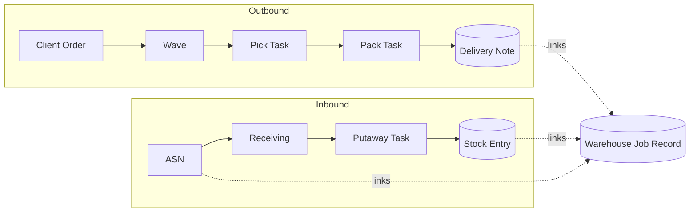

Warehouse 3PL models a warehouse that holds goods on behalf of **clients**.
The warehouse operator is a **bailee** — goods are stored, moved and shipped,
but never owned. Every stock entry is zero-value to preserve that accounting
boundary.

## Core vocabulary

| Term | Meaning |
|---|---|
| **Client** | An ERPNext Customer marked `is_3pl_client = 1`. |
| **Client Item** | A mapping from the client's SKU to an internal Item. |
| **Warehouse Location** | A bin — the smallest storable unit of space. |
| **Warehouse Job Record** | The central hub doc that stitches every operation, stock movement, and billing line for one job. |
| **Rate Card** | Per-client pricing used by the billing engine. |
| **Inventory Policy** | Rules that drive picking, putaway, and QC. |

## Two flows, one job

Every physical action the warehouse takes belongs to either the **inbound**
or **outbound** flow. Both are anchored to a **Warehouse Job Record**:

## Multi-client isolation

All operational doctypes carry a `client` field. Frappe permission rules
restrict each client role to only see rows where `client` matches their
account — so one warehouse, many isolated tenants.

## What each role does

- **Warehouse Operator** — creates Receiving from ASN, runs Pick/Pack Tasks
  on the floor, closes Putaway Tasks.
- **Warehouse Supervisor** — releases Waves, sets Inventory Policies,
  reviews the Warehouse Job Record dashboard.
- **Client User** — places Client Orders, views their inventory and
  delivery status. Sees only their own data.
- **Billing Admin** — configures Rate Cards, runs billing reports, issues
  Sales Invoices from Billing Transactions.

## Next

- [Inbound — Receiving](/user/inbound/)
- [Outbound — Fulfillment](/user/outbound/)
- [Warehouse Job Record](/user/warehouse-job/)
